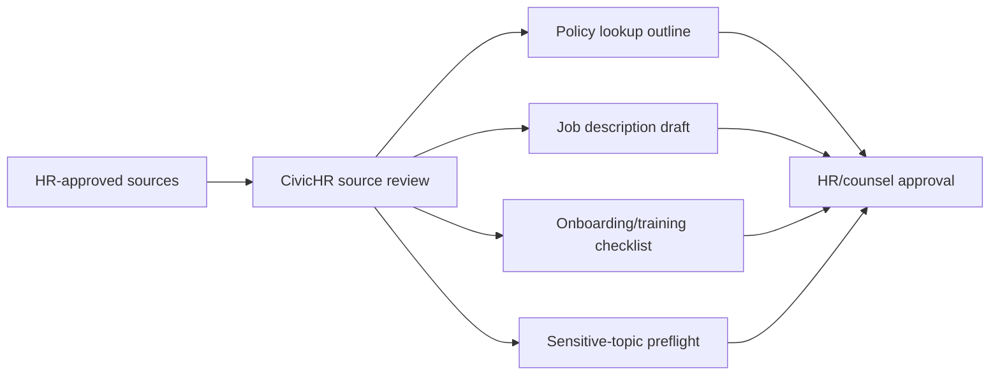

# CivicHR User Manual

## Non-technical staff guide

CivicHR helps HR staff prepare policy lookup outlines, handbook summaries, job-description drafts, onboarding packets, training checklists, intake templates, and optionally retrieve saved job/onboarding workpapers. It is not an HRIS and does not make HR decisions.

### What staff can do today

1. Check whether HR-approved source materials are ready for drafting.
2. Draft a personnel-policy lookup outline that must be reviewed by HR.
3. Draft plain-language handbook summaries.
4. Draft job-description sections from role duties.
5. Look up classification and salary schedule references without making compensation decisions.
6. Create onboarding and training checklists.
7. Prepare grievance or complaint intake templates without tracking cases or recommending outcomes.

### Required human review

HR and counsel review remain mandatory for HIPAA, FMLA, ADA, union agreement, discipline, discrimination, harassment, compensation, and personnel-file topics.

## IT and technical guide

Install with `python -m pip install -e ".[dev]"` and run with `python -m uvicorn civichr.main:app --host 127.0.0.1 --port 8138`.

Set `CIVICHR_WORKPAPER_DB_URL` to enable SQLAlchemy-backed job-description and onboarding-packet records. Leave it unset for deterministic stateless operation.

CivicHR depends on `civiccore==0.3.0`. It makes no default outbound calls.
